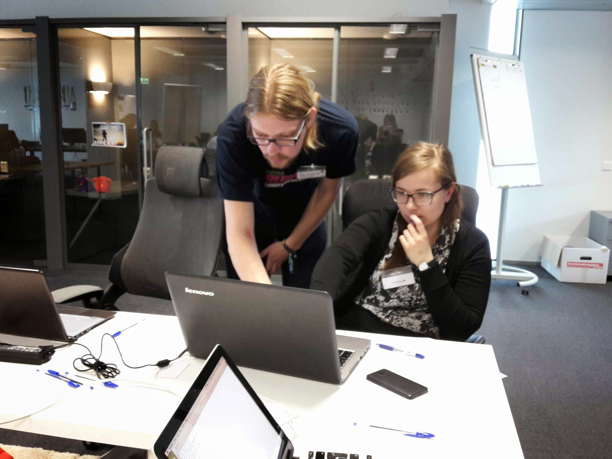
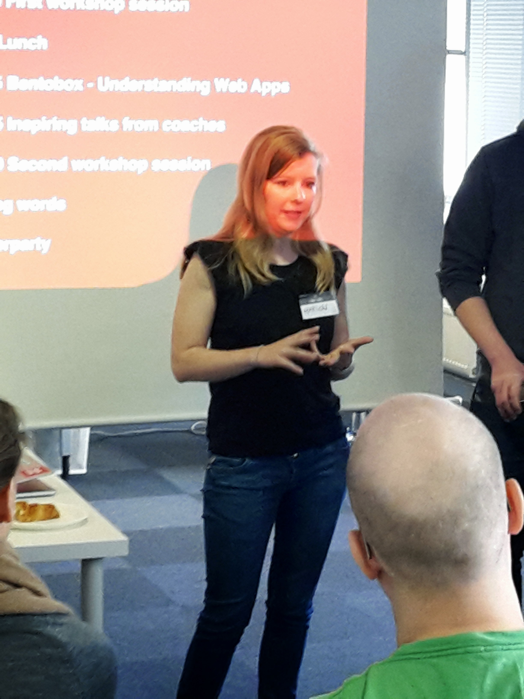

Two Simplificators, Marion and Ferdinand, have been to [Rails Girls in Helsinki](http://railsgirls.com/helsinki) as coaches. Here is a short travel report.

**Friday**

We arrived in Helsinki on Friday and went to meet the Rails Girls organizers of smartly.io in their office, where they welcomed us graciously. They could not believe that we flew to Helsinki just for the event and called us crazy people :). When they had the installation party, Ferdi and I went to explore the city. We met them again for dinner, where we had so much fun getting to know all the organizers and coaches.

**Saturday**

The event was a cooperation between smartly.io and vamos!, which is a charity organisation that looks after young people who have social difficulties and don’t know what to do with their lives. For this reason, there were some boys attending the event as well. There were also two boys who wanted to become DJs, and so this was a perfect event for them to practice.

The day started with a lengthy breakfast at the smartly office before the event, which is always nice. Then, I had a small talk about how I came to be a little programmer and why we flew all the way from Zurich. After this introduction, the workshop started. Ferdi and I coached a group of three girls together: two girls from Finland and one from Taiwan. We went through the Rails Girls tutorial, creating a simple website. It was strange to once know more about programming than others for a change, and I think I succeeded in answering their questions in a woman-friendly way. When I couldn’t answer a question, Ferdi was right there to explain. They were already done with the tutorial by lunchtime, so we advised them to actually learn a little more Ruby with Code School. It was really amazing how motivated the girls were, and that they didn’t give up when things didn’t work out right away. Also, they were eager to find out how these programming languages work, and really kind of got the hang of Ruby by the end of the day.

All in all, it was a great weekend and I have learned a lot. And more importantly, I am so happy to have been able to help these girls understand Ruby on Rails. Maybe, one of them will find her way into programming after the event.
